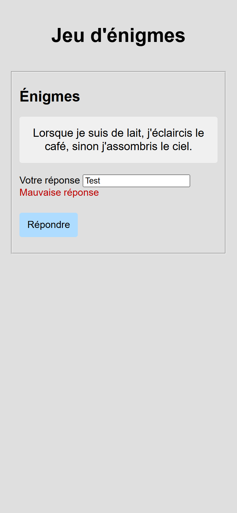

# riddle-quest

Five riddles for a child to solve, drawn at random from a bank of ten. Each
right answer earns a star; five stars end the quest.

Plain HTML, CSS and JavaScript. No framework, no build step, no dependency:
open the file and play.

> The user interface is in French, as is the code vocabulary. This README and
> the repository metadata are in English.

## Screenshots

## How it works

**Five draws, no repeats.** `initialiserEnigmes` loops five times. Each turn
picks a random index in the bank, copies the riddle and its answer into the
drawn arrays, then `splice`s both out of the bank, so the same riddle cannot
come up twice in a game. The bank is refilled by reloading the page.

**One index drives everything.** `intIndexEnigmeCourant` says which riddle
is on screen, which answer to check against, and which of the five stars to
reveal. A right answer increments it; nothing else does.

**A child's spelling is good enough.** Before comparing, both the typed text
and the expected answer go through `normaliser`: trimmed, lower-cased,
accents stripped and œ written oe. `Eponge`, `éponge` and `ÉPONGE` are the
same answer.

**Showing and hiding is one class.** Stars, the riddle area and the final
message all start with or without `.cacher`, and the script only adds or
removes that class. The stylesheet decides what hidden means.

**A wrong answer changes nothing but the message.** `Mauvaise réponse`
appears in red through the `.erreur` class, the riddle stays, the star stays
hidden, and the field keeps what was typed so the child can fix it.

## Running it

Open `index.html` in a browser. There is nothing to install.

## Stack

HTML, CSS and vanilla JavaScript. One stylesheet, two scripts, one star drawn
for the project.

## Résumé

Jeu d'énigmes pour enfants, en JavaScript sans dépendance. Au chargement,
cinq énigmes sont tirées au hasard dans une banque de dix, sans remise : la
pigée et sa réponse sont retirées de la banque par `splice`. Un seul index
désigne l'énigme affichée, la réponse attendue et l'étoile à révéler ; seule
une bonne réponse le fait avancer. Les réponses sont comparées après
normalisation, espaces, casse, accents et œ, pour qu'une faute d'accent ne
prive pas l'enfant de son étoile. L'apparition et la disparition des
éléments passent par une seule classe, `.cacher`, que le script pose ou
retire. Une mauvaise réponse affiche « Mauvaise réponse » en rouge et laisse
tout le reste en place. Interface et vocabulaire du code en français.

## Licence

MIT. See [LICENSE](LICENSE).
